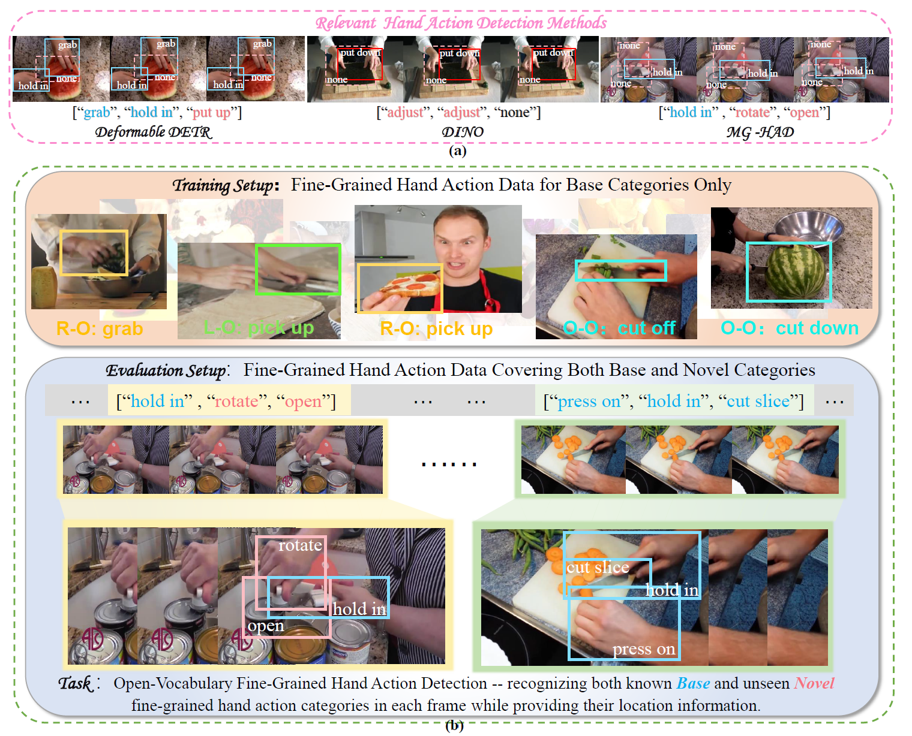

<h1 align="center"> Open-Vocabulary Fine-Grained Hand Action Detection </h1>

<p align="center">
  <a href="#News">News</a> |
  <a href="#Abstract">Abstract</a> |
  <a href="#Overview">Overview</a> |
  <a href="#Data preparation">Data preparation</a> |
   <a href="#Citation">Citation</a> |
</p>


## :fire: News

**2025.04.29**

- The paper "Open-Vocabulary Fine-Grained Hand Action Detection" has been accepted by the 34th International Joint Conference on Artificial Intelligence (IJCAI-25). We will release the data and related code soon and provide the Appendix in the official repository.


## :rocket: Introduction
This is the official repository of the paper Open-Vocabulary Fine-Grained Hand Action Detection.


## :page_facing_up: Abstract
In this work, we address the new challenge of open-vocabulary fine-grained hand action detection, which aims to recognize hand actions from both known and novel categories using textual descriptions. Traditional hand action detection methods are limited to closed-set detection, making it difficult for them to generalize to new, unseen hand action categories. While current open-vocabulary detection (OVD) methods are effective at detecting novel objects, they face challenges with fine-grained action recognition, particularly when data is limited and heterogeneous. This often leads to poor generalization and performance bias between base and novel categories. To address these issues, we propose a novel approach, Open-FGHA (Open-vocabulary Fine-Grained Hand Action), which learns to distinguish fine-grained features across multiple modalities from limited heterogeneous data. It then identifies optimal matching relationships among these features, enabling accurate open-vocabulary fine-grained hand action detection. Specifically, we introduce three key components: Hierarchical Heterogeneous Low-Rank Adaptation, Bidirectional Selection and Fusion Mechanism, and Cross-Modality Query Generator. These components work in unison to enhance the alignment and fusion of multimodal fine-grained features. Extensive experiments demonstrate that Open-FGHA outperforms existing OVD methods, showing its strong potential for open-vocabulary hand action detection.

<div align=center>

</div>
Overview of the OV-FGHAD. (a) Detection performance of existing representative fine-grained hand action detection methods. (b) Basic setup of the new task (OV-FGHAD). Training and evaluation configurations of our method Open-FGHA, which primarily follows a generalized setting. Base categories are represented by light blue boxes and text, while novel categories are shown by pink boxes and text. Misclassified categories are highlighted in red. Missed detections for novel categories are highlighted in pink dashed boxes. Each hand action event is denoted as [“left hand-object interaction (L-O)”, “right hand-object interaction (R-O)”, “object-object interaction (O-O)”], indicating the corresponding fine-grained hand action.

## :page_facing_up: Overview

<div align=center>

</div>

Open-FGHA is a simple yet strong open-vocabulary fine-grained hand action detection model. Open-FGHA consists of three novel components: (1) HiH-LoRA: A module specifically designed for limited heterogeneous data, enabling effective extraction of multimodal fine-grained features while maintaining model balance (see Section 3.2); (2) BSF Mechanism: Comprising a bidirectional selective cross-attention module and multiple fusion processes, this mechanism identifies the optimal matching between multimodal fine-grained features, reducing confusion between fine-grained categories (see Section 3.3); (3) CQG: A cross-modality decoder module that utilizes high-quality multimodal fine-grained features to generate enhanced cross-modal queries, further improving content representation and inter-modal correlation (see Section 3.4). The top indicates the whole pipeline, and the bottom describes each module.


## :sparkles: Data preparation
The FHA-Kitchens OVD benchmark is reconstructed from the publicly available FHA-Kitchens benchmark. FHA-Kitchens OVD data can be downloaded [here](https://drive.google.com/drive/folders/1ZBD8GnhPt3kgWuyzrz_hTeOk4lZdNpGP?usp=drive_link), the annotation files and Appendix can be downloaded from [here](https://drive.google.com/drive/folders/1mgb1yq9uYEEMKcuUXQb99WGfQpM70Pnr?usp=drive_link)


## :blush: Statement

This project is for research purposes only. For further questions, please contact Ting Zhe at zheting@whu.edu.cn.


## :pushpin: Citation
```bibtex
@inproceedings{ijcai2025p276,
  title     = {Open-Vocabulary Fine-Grained Hand Action Detection},
  author    = {Zhe, Ting and Han, Mengya and Hao, Xiaoshuai and Luo, Yong and He, Zheng and Cai, Xiantao and Zhang, Jing},
  booktitle = {Proceedings of the Thirty-Fourth International Joint Conference on
               Artificial Intelligence, {IJCAI-25}},
  publisher = {International Joint Conferences on Artificial Intelligence Organization},
  editor    = {James Kwok},
  pages     = {2476--2484},
  year      = {2025},
  month     = {8},
  note      = {Main Track},
  doi       = {10.24963/ijcai.2025/276},
  url       = {https://doi.org/10.24963/ijcai.2025/276},
}
```

